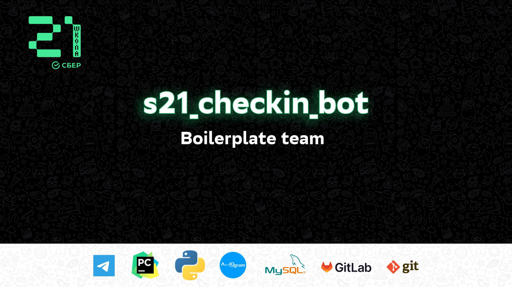

# Presentation

Бот-призёр всероссийского хакатона Sber.Weeklyton_2022. Топ 3/40+

### [Youtube промо](https://youtu.be/ijyiGwNqzvA)

## Contents

1. [Chapter I](#chapter-i) \
   1.1. [Intro](#intro)
2. [Chapter II](#chapter-ii) \
   2.1. [Task Presentation](#task-presentation)
3. [Chapter III](#chapter-iii) \
   3.1. [Part 1. Презентация](#part-1-презентация)  
   3.2. [Part 2. Подготовка демонстрации](#part-2-подготовка-демонстрации)  
   3.3. [Part 3. Bonus](#part-3-bonus)

# Chapter I

## Intro

Изнурительные 4 дня разработки позади, и нам предстояло подготовиться к представлению полученных результатов. Конечно, они
были еще далеки от идеала, и многое хотелось бы переделать (не считая огромного списка нереализованных фич), но совсем
скоро наступала пора улетать домой, а порадоваться выполненному [тикету](materials/tickets/ticket_42_1004.md) очень хотелось (уж больно много сил было уже вложено в эти
задачи).  
По опыту, мы знали, что хорошая презентация — это зачастую не менее важно, чем сам факт успешного выполнения проекта.
Подготовка презентации — это сложная многофакторная задача — необходимо выделить основное, про что следует рассказать и
сфокусироваться на этом (никто не будет слушать презентацию длиннее 5 минут), подготовиться к неудобным вопросам и
продумать демонстрацию (в том числе с учетом всех “недоделок”).

# Chapter II

## Task Presentation

Разработку презентации мы так же, как и остальные блоки задач декомпозировали на последовательность подзадач, назначили
ответственных - и нырнули в новый этап работы. На всю защиту было не больше 10 минут: 5 минут на презентацию, 2 на [демонстрацию](src/presentation/demo.md) проекта и 3 на ответы на вопросы.

# Chapter III

## Part 1. Презентация

Формализация и разработка слайдов презентации. Каждой задаче может соответствовать от 1 до 3
слайдов.

| Задача | Артефакт                                            | Характеристика |  
|--------|-----------------------------------------------------|--------------|  
| 1.1. Слайд с названием команды и названием бота | Презентация   [*src/presentation/presentation.**](src/presentation/presentation.pdf) | -=no comments=- |
| 1.2. Проблема и актуальность | Презентация   [*src/presentation/presentation.**](src/presentation/presentation.pdf) | Описание проблемы и актуальности |
| 1.3. Существующие решения  | Презентация   [*src/presentation/presentation.**](src/presentation/presentation.pdf) | Анализ существующих решений | 
| 1.4. Постановка задачи | Презентация   [*src/presentation/presentation.**](src/presentation/presentation.pdf) | IDEF0 + ограничения |  
| 1.5. Предлагаемое решение | Презентация   [*src/presentation/presentation.**](src/presentation/presentation.pdf) | Use case diagram, ERD |  
| 1.6. Архитектура и технологический стек | Презентация   [*src/presentation/presentation.**](src/presentation/presentation.pdf) | Архитектурное решение, диаграмма компонентов, технологический стек |
| 1.7. Состав команды и план разработки | Презентация   [*src/presentation/presentation.**](src/presentation/presentation.pdf) | -=no comments=- |
| 1.8. Особенности реализации | Презентация   [*src/presentation/presentation.**](src/presentation/presentation.pdf) | Интересные особенности. Алгоритмы, архитектурные и технологические решения, решения в области UI/UX или бизнес-логики системы |
| 1.9. UI/UX  | Презентация   [*src/presentation/presentation.**](src/presentation/presentation.pdf) | Макеты и их реализация или описание UI на командах | 
| 1.10. План развития и внедрения | Презентация [*src/presentation/presentation.**](src/presentation/presentation.pdf) | Шаги, которые отделяют прототип от промышленного использования |  

## Part 2. Подготовка демонстрации

| Задача | Артефакт | Рекомендации |  
|--------|---------|--------------|  
| 2.1. План демонстрации | План демонстрации   [*src/presentation/demo.md*](src/presentation/demo.md)   [Видео](https://youtu.be/ijyiGwNqzvA)  | Демонстрация решения за 2 минуты так, чтобы ни у кого не осталось сомнений, что это лучший бот в галактике |

## Part 3. Bonus

| Задача                 | Артефакт                                                                        | Рекомендации    |  
|------------------------|---------------------------------------------------------------------------------|-----------------|  
| 3.1. QR-код для мгновенного доступа к боту | Презентация   [*src/presentation/presentation.**](src/presentation/presentation.pdf) | -=no comments=- |
| 3.2. Рекламный ролик проекта | Презентация (добавлена ссылка на [ролик](https://youtu.be/ijyiGwNqzvA))   [*src/presentation/presentation.**](src/presentation/presentation.pdf) | Ролик в 30 секунд, рекламирующий вашего бота для запуска по всем кампусам галактики. |
